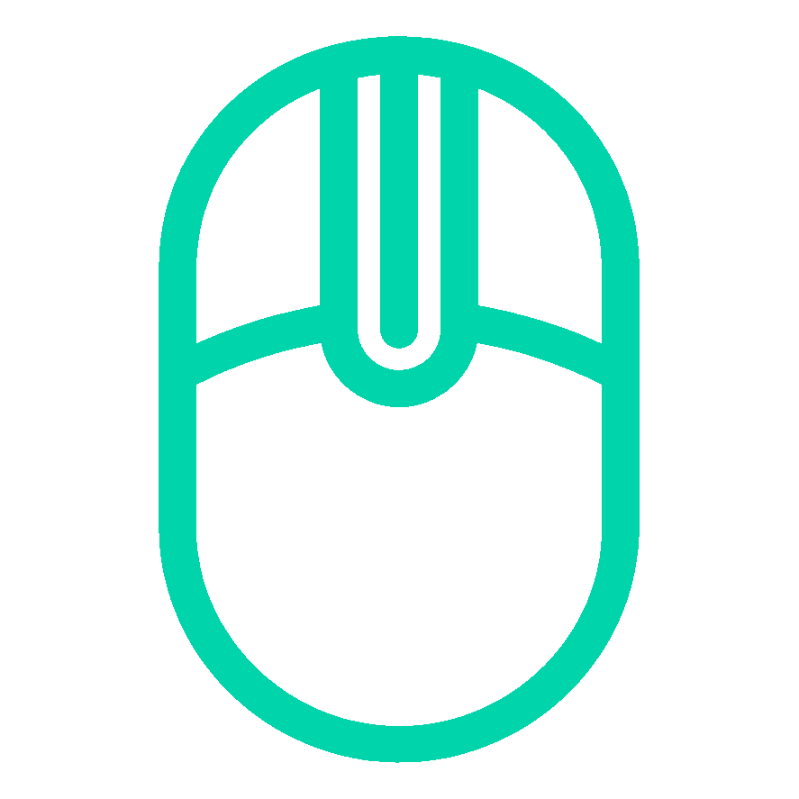

<p align="center">
  
</p>

<h1 align="center">MasterMice</h1>

<p align="center">
  <strong>Unlock your Logitech MX Master. Without the bloatware.</strong><br>
  Open-source &nbsp;&middot;&nbsp; 3 MB binary &nbsp;&middot;&nbsp; Zero telemetry &nbsp;&middot;&nbsp; Full hardware control
</p>

<p align="center">
  <a href="https://github.com/olafnew/MasterMice/releases/latest">
    
  </a>
  &nbsp;
  <a href="LICENSE">
    
  </a>
</p>

---

## Why This Exists

Logitech builds extraordinary hardware. The MX Master 4 has a haptic motor, a force-sensitive thumb panel, a magnetically adjustable scroll wheel — real engineering packed into a beautiful device.

Then they wrap it in **Logi Options+**: six background processes consuming 350+ MB of RAM, a [well-documented memory leak](https://logitech.uservoice.com/forums/925117-logi-options/suggestions/45330115-memory-leak-with-the-latest-logi-options) that's been open for three years and can balloon to gigabytes, an "AI Prompt Builder" that nobody asked for, constant nudges to sign into a cloud account, and [telemetry phoning home](https://www.logitech.com/assets/66289/logi-options-security-whitepaper.pdf). All to configure a mouse.

MasterMice was born out of that frustration. The idea is simple: **a tiny, instant service that unlocks every feature of your MX Master hardware — without the overhead, the accounts, or the surveillance.**

The entire Go service binary is **3 MB**. It starts in milliseconds. It uses negligible RAM. And it gives you deeper hardware control than Options+ does — including haptic pulse patterns and force sensor thresholds that Logitech's own software doesn't expose.

> MasterMice builds on the original [Mouser](https://github.com/TomBadash/Mouser) project by [TomBadash](https://github.com/TomBadash), which proved that open-source MX Master control was possible and built a community around it. MasterMice extends that foundation with full MX Master 4 support, a completely reverse-engineered USB protocol, haptic motor control, force sensor tuning, and a new service-based architecture.

---

## What's New

### v0.51 — Gesture Swipes (latest)
- **Gesture button swipes**: hold gesture button + move to switch virtual desktops (left/right), minimize all windows (down), restore all (up)
- **Raw XY movement decoding**: firmware-diverted mouse sensor data decoded from HID++ divertedRawXY reports
- **Haptic feedback on desktop switch**: Light pulse when switching virtual desktops via gesture
- **Configurable swipe actions**: each direction mapped independently in config

### v0.50 — Go Agent + Button Actions
- **Go agent process**: instant button action execution (no Python round-trip)
- **Haptic Sense Panel + Gesture Button** → Win+Tab by default
- **Button sensitivity**: Light / Medium / Hard / Firm presets (protocol decoded from Wireshark USB captures)
- **Haptic motor**: 8 pulse patterns, intensity slider, sequence builder, charge/uncharge notifications
- **Windows service (SCM)**: install/uninstall via Settings, auto-restart on failure
- **Service auto-launch**: app starts the service if not running, version mismatch detection + auto-restart

### v0.40 — Service Architecture
- **Go Windows service** for HID++ device management (replaces in-process HID)
- **Named pipe IPC** (JSON-lines protocol) between service and Python UI
- All device reads/writes through the service — UI can close without losing device connection

---

## How It Compares

|  | **Logi Options+** | **Mouser** | **MasterMice** |
|---|---|---|---|
| **RAM usage** | ~350 MB across 6 processes ([known leaks to 8 GB+](https://logitech.uservoice.com/forums/925117-logi-options/suggestions/49898499)) | ~40-60 MB (single Python process) | **~3 MB** Go service + Python UI |
| **Startup** | Multiple services, slow init | Python app launch | Go service: instant, starts at boot |
| **Account required** | Persistent sign-in prompts | No | No |
| **Telemetry** | Yes ([cloud sync, analytics](https://www.logitech.com/assets/66289/logi-options-security-whitepaper.pdf)) | None | None |
| **Supported mice** | All Logitech mice + keyboards | MX Master 2, 3, 3S + generic fallback | MX Master 3, 3S, **4** — auto-detected |
| **Haptic motor (MX4)** | Basic on/off + 2 patterns | N/A | **Full control**: 8 pulse patterns, intensity 0-100% |
| **Force sensor (MX4)** | Simple toggle | N/A | **4 presets**: Light / Medium / Hard / Firm |
| **Gesture swipes** | 4-direction gestures | Gesture button click only | **Hold + swipe**: 4 directions + click, each configurable |
| **SmartShift** | Single combined slider | Threshold only | **Threshold + force** (MX4 has both) |
| **Button remapping** | Yes, with cloud profiles | Yes | Yes, all buttons + gesture swipes |
| **Per-app profiles** | Yes (cloud-synced) | Yes (local) | Yes (local) |
| **DPI control** | Yes | Yes | Yes (device-capped: 4000 / 8000) |
| **OS support** | Windows, macOS | Windows, macOS, Linux (experimental) | Windows |
| **Architecture** | Electron-based UI + multiple daemons | Single Python process | Go service + Go agent + Python UI |
| **Open source** | No | Yes (MIT) | Yes (MIT) |

### What Mouser Does Well

[Mouser](https://github.com/TomBadash/Mouser) is a legitimate project with thousands of stars and real contributions. It supports **three platforms** (Windows, macOS, experimental Linux), has early multi-device detection for mice beyond the MX Master family, and has an active community. If you need cross-platform support or use a non-Master-series mouse, Mouser may be the better choice today.

### Where MasterMice Goes Further

MasterMice focuses on **depth over breadth**: fully decoding the MX Master 4's proprietary protocol, exposing hardware features that neither Options+ nor Mouser touch, and running as a proper Windows service with minimal resource footprint. The HID++ protocol has been reverse-engineered from Wireshark USB captures and verified through live hardware testing — including the empirical discovery that Bolt receiver haptic commands require USB SET_REPORT control transfers (not interrupt writes), a dual-handle architecture for short/long HID++ reports, and bitmask-based haptic pulse combinations that create compound tactile patterns.

---

## Features

### Gesture Swipes
Hold the gesture button and move the mouse to trigger directional actions. The MX4 firmware diverts raw sensor data into the HID++ channel while the button is held — MasterMice decodes this stream and detects swipe direction with configurable threshold and deadzone.

**Default gestures:**
- **Left / Right** — Switch virtual desktops (with haptic Light pulse feedback)
- **Down** — Minimize all windows
- **Up** — Restore all windows
- **Click** (no movement) — Task View (Win+Tab)

Each direction is independently configurable.

### Haptic Motor Control (MX Master 4)

The MX4 contains a linear resonant actuator — the same family of motors used in PS5 DualSense controllers and Nintendo Joy-Con HD Rumble. Options+ uses two patterns. MasterMice exposes **eight distinct pulse types**: four base waveforms (Nudge, Light, Tick, Strong) and four compound patterns created by combining bits (Buzz, Burst, Triple, Double-Buzz). Intensity is adjustable from 0% to 100%. Sequences can chain pulses with configurable delays.

Haptic events:
- **Charge connected** — Buzz 0.5s × 3
- **Charge disconnected** — Triple pulse
- **Virtual desktop switch** — Light pulse

### Force-Sensitive Thumb Panel (MX Master 4)

The MX4's haptic sense panel has a pressure sensor with configurable thresholds. MasterMice gives you four presets — Light, Medium, Hard, Firm — that directly control the force values sent to the device (protocol decoded from Wireshark USB captures of Logitech Options+). Options+ hides this behind a simple toggle.

### SmartShift Scroll Wheel

Two independent parameters: the **speed threshold** where the wheel switches from ratchet to freewheel, and on the MX4, the **magnetic resistance force**. Options+ combines these into a single slider. MasterMice separates them.

### Button Remapping

All programmable buttons: middle click, gesture button, back, forward, scroll mode toggle, thumb wheel, and the MX4's haptic sense panel. Per-application profiles switch automatically based on the foreground window. 24+ built-in actions across navigation, browser, editing, media, and gesture categories.

### DPI & Scrolling

DPI slider with device-appropriate limits (4000 for MX3, 8000 for MX4). Hi-res scrolling toggle with speed divider, smooth scrolling toggle, independent scroll direction inversion for both axes, Windows pointer speed control.

### Battery

Real-time battery level via HID++ polling and push events. Charging state detection works via Bolt (decoded from battery status byte, not ext_power — empirically discovered that Bolt receivers don't set the ext_power field). Color-coded badge in the UI header.

### Auto-Detection

MasterMice identifies your mouse model automatically at connection — MX Master 3, 3S, or 4 — and loads the correct feature set, feature indices, and UI layout. No manual device selection.

---

## Architecture

```
┌──────────────────────────────────┐  ┌──────────────────────────────────┐
│  Go Service (mastermice-svc)     │  │  Go Agent (mastermice-agent)     │
│                                  │  │                                  │
│  HID++ 2.0 protocol engine       │  │  Button action execution         │
│  Device discovery & auto-detect  │  │  Gesture swipe detection         │
│  Battery / DPI / SmartShift      │  │  WH_MOUSE_LL hook (OS buttons)   │
│  Haptic motor / Force sensor     │──│  Foreground app detection         │
│  Named pipe server (JSON-lines)  │  │  Profile auto-switching           │
│  Event pipe (push stream)        │  │  SendInput key injection          │
│  Windows SCM service             │  │                                  │
│                                  │  │  Runs in user session             │
│  3 MB · Starts at boot           │  │  Instant button response          │
│  Survives UI crashes             │  └──────────────────────────────────┘
└──────────────────────────────────┘
           ▲ named pipe                ┌──────────────────────────────────┐
           │                           │  Python App (MasterMice.exe)     │
           └───────────────────────────│                                  │
                                       │  QML settings UI                 │
                                       │  System tray icon                │
                                       │  Config editor                   │
                                       │  Status viewer                   │
                                       │                                  │
                                       │  Can close without losing        │
                                       │  any mouse functionality         │
                                       └──────────────────────────────────┘
```

Three processes, clean separation:
- **Service** — owns all HID++ device I/O. Runs as Windows service or standalone. Communicates via named pipe (`\\.\pipe\MasterMice`).
- **Agent** — runs in the user's desktop session. Handles button actions via SendInput, gesture swipe detection, mouse hooks, and app-based profile switching. Connects to service via event pipe for real-time button/battery events.
- **Python App** — configuration UI only. Launches the service and agent if not running. Config changes are written to `%APPDATA%\MasterMice\config.json` and picked up by the agent.

---

## Supported Devices

| Device | Connection | DPI | SmartShift | Haptics | Force Sensor | Status |
|--------|-----------|-----|------------|---------|-------------|--------|
| **MX Master 4** | Bolt / BT | 200–8000 | v2 (threshold + force) | 8 patterns | 4 presets | Fully supported |
| **MX Master 3 / 3S** | Unifying / BT | 200–4000 | v1 (threshold) | — | — | Fully supported |

Devices are auto-detected by name at connection. More Logitech mice planned (MX Anywhere, MX Vertical, MX Ergo).

---

## Quick Start

> **No install required.** Download, extract, run.

1. Download the [latest release](https://github.com/olafnew/MasterMice/releases/latest)
2. Extract the zip anywhere
3. Run **MasterMice.exe**

**First launch notes:**
- Windows SmartScreen may warn on first run — click **More info → Run anyway**
- MasterMice will **automatically stop Logi Options+** if it's running (they cannot share the HID handle) and show a popup explaining how to disable it permanently
- A system tray icon appears — the app stays running when you close the window
- Config saves to `%APPDATA%\MasterMice\` (auto-migrated from Mouser if upgrading)

---

## Running from Source

**Prerequisites:** Windows 10/11, Python 3.10+, Go 1.21+, MinGW-w64 (for CGO/hidapi). MX Master 3/3S/4 paired via Bluetooth or USB receiver. Logi Options+ must not be running.

```bash
git clone https://github.com/olafnew/MasterMice.git
cd MasterMice

# Python UI
python -m venv .venv
.venv\Scripts\activate
pip install -r requirements.txt
python main_qml.py

# Go service + agent (separate terminal)
cd service
go build -o mastermice-svc.exe ./cmd/mastermice-svc
go build -o mastermice-agent.exe ./cmd/mastermice-agent
./mastermice-svc.exe
# (in another terminal)
./mastermice-agent.exe
```

### Building a Portable Release

```bash
pip install pyinstaller
.venv\Scripts\pyinstaller MasterMice.spec --noconfirm
```

Output goes to `dist\MasterMice {version}\` with Go binaries bundled in `_internal/`.

---

## Diagnostic Tools

Standalone utilities in `tools/` for protocol debugging:

| Tool | Purpose |
|------|---------|
| `battery_test.py` | Battery protocol debugger |
| `smartshift_test.py` | SmartShift protocol debugger |
| `hid_debug.py` | HID interface and collection enumerator |
| `haptic_hybrid.py` | Haptic motor test via dual HID handles |
| `mx4_haptic_probe.py` | Haptic SET_REPORT probe |
| `fix_receiver.ps1` | Logitech receiver driver reset |

Go-based test tools in `service/cmd/`:

| Tool | Purpose |
|------|---------|
| `haptic-test` | Interactive haptic pulse tester (all 8 patterns) |
| `haptic-probe` | Deep haptic protocol explorer (all functions + bit combos) |
| `btnsens-test` | Button sensitivity protocol prober |
| `pipe-test` | Named pipe IPC test client |

---

## Roadmap

- [ ] **Gesture UI** — tabbed action picker with visual gesture diagram (Gestures | Shortcuts tabs)
- [ ] **Data-driven device profiles** — JSON device files for power users to add custom mice
- [ ] **Windows Shell haptics** — feel a buzz when you snap windows, alt-tab, or minimize (Go microservice with SetWinEventHook)
- [ ] **Multi-device support** — MX Anywhere, MX Vertical, MX Ergo, and future models
- [ ] **Strip Python dependency** — agent handles all buttons, hooks, app detection; Python app becomes pure config editor
- [ ] **Full SCM service** — Session 0 operation, multi-user config layers, WTS session notifications
- [ ] **Installer + auto-update** — NSIS/WiX installer, GitHub release checker
- [ ] **Code signing** via [SignPath Foundation](https://signpath.org/) (free for open-source)

---

## Credits

- Original project: [TomBadash/Mouser](https://github.com/TomBadash/Mouser) — the spark that started this
- macOS foundation: [andrew-sz](https://github.com/andrew-sz)
- Multi-device expansion in Mouser: [thisislvca](https://github.com/thisislvca)
- HID++ protocol decoded via Wireshark USB captures and live hardware testing

## License

[MIT](LICENSE)

---

<sub>MasterMice is not affiliated with or endorsed by Logitech. "Logitech", "MX Master", "Logi Options+", and "Bolt" are trademarks of Logitech International S.A.</sub>
